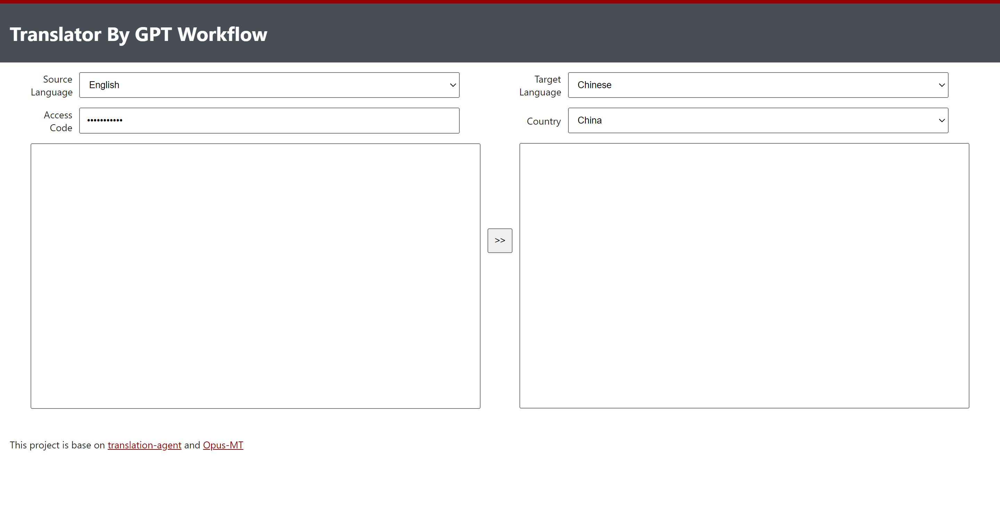

# translation-website
This project is base on [translation-agent](https://github.com/andrewyng/translation-agent) and [Opus-MT](https://github.com/Helsinki-NLP/Opus-MT/tree/master/static)  

## Deployment
### Frontend
use nginx to deploy it.
### Backend
1. First, install dependencies.
```shell
cd backend
pip install -r requirements.txt
```
2. Then, set environment variables
```
OPENAI_API_KEY="sk-xxxxx"    # replace "sk-xxxxx" with your secret OpenAI API key
BASE_URL="https://api.openai.com/v1/chat/completions" # optional
ACCESS_CODE="GPT"
```
3. Start
```shell
python app.py
```
  
write later.
